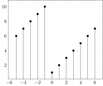

# InfiniteVectors.jl

*A Julia package for infinite vectors operations such as convolution and z-transform.*


| **Documentation** | **Build Status** | **Coverage** |
|-------------------|------------------|--------------|
| [](https://FrameFunVC.github.io/InfiniteVectors.jl/stable)  [](https://FrameFunVC.github.io/InfiniteVectors.jl/dev) | [](https://travis-ci.org/FrameFunVC/InfiniteVectors.jl) [](https://ci.appveyor.com/project/FrameFunVC/InfiniteVectors-jl) | [](https://codecov.io/gh/FrameFunVC/InfiniteVectors.jl)  [](https://coveralls.io/github/FrameFunVC/InfiniteVectors.jl) |


Installation instructions and full functionality can be found in the [documentation](https://FrameFunVC.github.io/InfiniteVectors.jl/dev)

## Examples

```julia
julia> using InfiniteVectors, PGFPlotsX
julia> Plot(CompactInfiniteVector(1:4,-1))
```

```julia
julia> Plot(PeriodicInfiniteVector(1:10))
```

